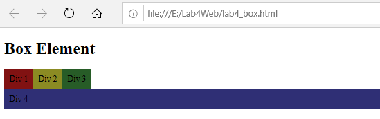
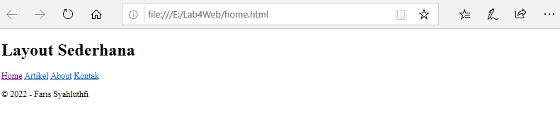
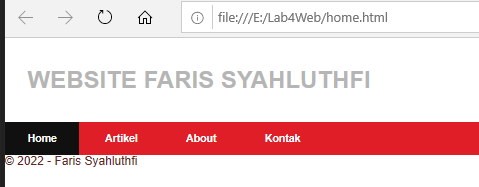
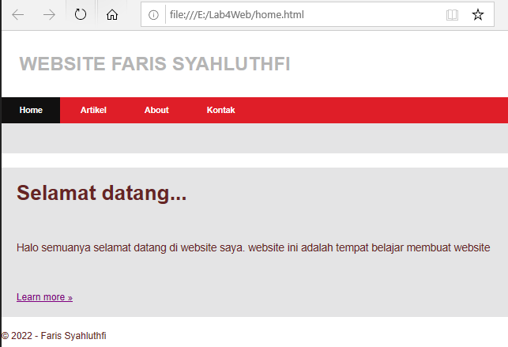
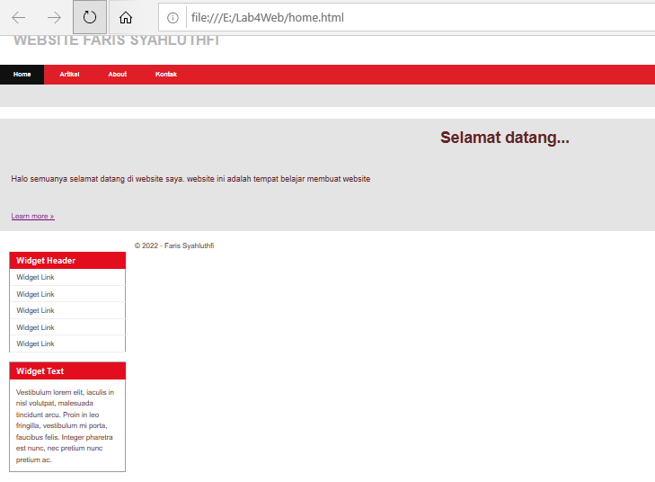
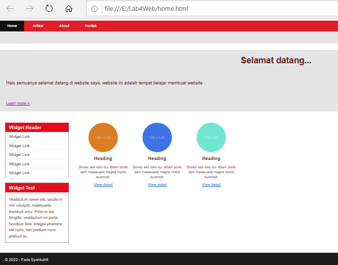
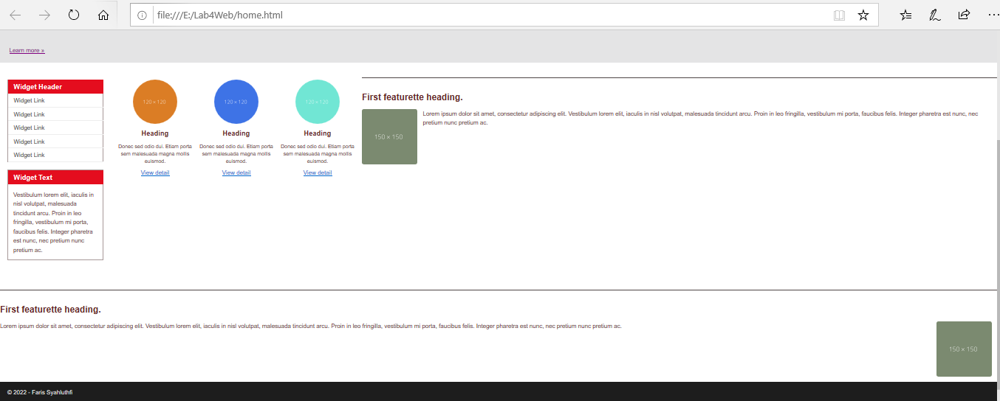

# Lab4Web

| Nama= Faris Syahluthfi      | 
|-----------------------------|
| NIM= 312010034              |
|=============================| 
| Kelas= TI.20.A.1            |
|-----------------------------|
| Matkul= Pemrograman Web     |
|=============================|

## 1. Membuat Box Element


Ini adalah sebuah hasil dari texs Kodingan tag Membuat Box Element<p>
 Dan Ini Adalah program codingan dari tag Membuat Box Element:

```html
<!DOCTYPE html>
<html lang="en">
<head>
<meta charset="UTF-8">
<meta name="viewport" content="width=device-width, initial-scale=1.0">
<title>Box Element</title>
</head>
<body>
<header>
<h1>Box Element</h1>
</header>

<section>
    <div class="div1">Div 1</div>
    <div class="div2">Div 2</div>
    <div class="div3">Div 3</div>
    <div class="div4">Div 4</div>
    </section>

    </body>
</html>
 ```

 ## CSS Float Property
 Selanjutnya tambahkan deklarasi CSS pada head untuk membuat float element, seperti berikut:

 ```css
 <style>
        div {
        float:left;
        padding: 10px;
        }
        .div1 {
        background: rgb(129, 18, 18);
        }
        .div2 {
        background: rgb(139, 139, 35);
        }
        .div3 {
        background: rgb(39, 92, 39);
        }

        .div4 {
        background-color: rgb(47, 47, 117);
        clear: left;
        float: none;
        }
        
        </style>

 ```


## 2. Membuat Layout Sederhana


Ini adalah sebuah hasil dari texs Kodingan tag Membuat Layout Sederhana<p>
 Dan Ini Adalah program codingan dari tag Membuat Layout Sederhana:

## Contoh Kode
```Html
<!DOCTYPE html>
<html lang="en">
<head>

    <meta charset="UTF-8">
    <meta name="viewport" content="width=device-width, initial-scale=1.0">

<title>Layout Sederhana</title>
<link rel="stylesheet" href="style.css">
</head>
<body>
<div id="container">
</div>

<header>
    <h1>WEBSITE FARIS SYAHLUTHFI</h1>
    </header>
    <nav>
    <a href="home.html" class="active">Home</a>
    <a href="artikel.html">Artikel</a>
    <a href="about.html">About</a>
    <a href="kontak.html">Kontak</a>
    </nav>
    <section id="hero"></section>
    <section id="wrapper">
    <section id="main"></section>
    <aside id="sidebar"></aside>
    </section>
    <footer>
    <p>&copy; 2022 - Faris Syahluthfi</p>
    </footer>


</body>
</html>
```

Kemudian tambahkan kode CSS untuk membuat layoutnya:
```css
/* import google font */
@import
url('https://fonts.googleapis.com/css2?family=Roboto&family=Rubik+Wet+Paint&display=swap');
@import
url('https://fonts.googleapis.com/css2?family=Roboto&family=Rubik+Wet+Paint&display=swap');
/* Reset CSS */
* {
margin: 0;
padding: 0;
}
body {
line-height:1;
font-size:100%;
font-family:'Open Sans', sans-serif;
color:#662424;
}
#container {
width: 980px;
margin: 0 auto;
box-shadow: 0 0 1em #cccccc;
}
/* header */
header {
padding: 20px;
}
header h1 {
margin: 20px 10px;
color: #b5b5b5;
}

```


## 4. Membuat Navigasi


Ini adalah sebuah hasil dari texs Kodingan tag Membuat Navigasi<p>
 Dan Ini Adalah program codingan dari tag Membuat Navigasi:

 ```css

/* navigasi */
nav {
    display: block;
    background-color: #df1e28;
    }
    nav a {
    padding: 15px 30px;
    display: inline-block;
    color: #ffffff;
    font-size: 14px;
    text-decoration: none;
    font-weight: bold;
    }
    nav a.active,
    nav a:hover {
    background-color: #111010;
    }

```

## 5. Membuat Hero Panel.
Selanjutnya membuat hero panel. Tambahkan kode HTML dan CSS seperti berikut:

```html
<!DOCTYPE html>
<html lang="en">
<head>

    <meta charset="UTF-8">
    <meta name="viewport" content="width=device-width, initial-scale=1.0">

<title>Layout Sederhana</title>
<link rel="stylesheet" href="style.css">
</head>
<body>
<div id="container">
</div>

<header>
    <h1>WEBSITE FARIS SYAHLUTHFI</h1>
    </header>
    <nav>
    <a href="home.html" class="active">Home</a>
    <a href="artikel.html">Artikel</a>
    <a href="about.html">About</a>
    <a href="kontak.html">Kontak</a>
    </nav>
    <section id="hero"></section>
    <section id="wrapper">
    <section id="main"></section>
    <aside id="sidebar"></aside>
    </section>

    <section id="hero">
        <h1>Selamat datang...</h1>
        <p>Halo semuanya selamat datang di website saya. website ini adalah tempat belajar membuat website</p>
        <a href="home.html" class="btn btn-large">Learn more &raquo;</a>
        </section>
        <footer>
    <p>&copy; 2022 - Faris Syahluthfi</p>
    </footer>


</body>
</html>

```

```css
 /* Hero Panel */
#hero {
    background-color: #e4e4e5;
    padding: 25px 25px;
    margin-bottom: 25px;
    }
    #hero h1 {
    margin-bottom: 50px;
    font-size: 35px;
    }
    #hero p {
    margin-bottom: 50px;
    font-size: 18px;
    line-height: 50px;
    }

```

## Hasil dari kodingan diatas:


## 6. Mengatur Layout Main dan Sidebar
Selanjutnya mengatur main content dan sidebar, tambahkan CSS float:
```css
/* main content */
#wrapper {
    margin: 0;
    }

    #main {
        float: left;
        width: 640px;
        padding: 20px;
        }
        /* sidebar area */
        #sidebar {
        float: left;
        width: 260px;
        padding: 20px;
        }
```

## 7. Membuat Sidebar Widget
Kemudian selanjutnya menambahkan element lain dalam sidebar:

```html
<!DOCTYPE html>
<html lang="en">
<head>

    <meta charset="UTF-8">
    <meta name="viewport" content="width=device-width, initial-scale=1.0">

<title>Layout Sederhana</title>
<link rel="stylesheet" href="style.css">
</head>
<body>
<div id="container">
</div>

<header>
    <h1>WEBSITE FARIS SYAHLUTHFI</h1>
    </header>
    <nav>
    <a href="home.html" class="active">Home</a>
    <a href="artikel.html">Artikel</a>
    <a href="about.html">About</a>
    <a href="kontak.html">Kontak</a>
    </nav>
    <section id="hero"></section>
    <section id="wrapper">
    <section id="main"></section>
    <aside id="sidebar"></aside>
    </section>

    <section id="hero">
        <h1>Selamat datang...</h1>
        <p>Halo semuanya selamat datang di website saya. website ini adalah tempat belajar membuat website</p>
        <a href="home.html" class="btn btn-large">Learn more &raquo;</a>
        </section>

        <aside id="sidebar">
            <div class="widget-box">
            <h3 class="title">Widget Header</h3>
            <ul>
            <li><a href="#">Widget Link</a></li>
            <li><a href="#">Widget Link</a></li>
            <li><a href="#">Widget Link</a></li>
            <li><a href="#">Widget Link</a></li>
            <li><a href="#">Widget Link</a></li>
            </ul>
            </div>
            <div class="widget-box">
            <h3 class="title">Widget Text</h3>
            <p>Vestibulum lorem elit, iaculis in nisl volutpat, malesuada tincidunt
            arcu. Proin in leo fringilla, vestibulum mi porta, faucibus felis. Integer
            pharetra est nunc, nec pretium nunc pretium ac.</p>
            </div>
            </aside>

            <footer>
    <p>&copy; 2022 - Faris Syahluthfi</p>
    </footer>


</body>
</html>

```

Kemudian tambahkan CSS:
```css
/* widget */
.widget-box {
    border:1px solid rgb(167, 152, 152);
    margin-bottom:20px;
    }
    .widget-box .title {
    padding:10px 16px;
    background-color:#e40d1e;
    color:#fff;
    }
    .widget-box ul {
    list-style-type:none;
    }
    .widget-box li {
    border-bottom:1px solid #eee;
}
.widget-box li a {
padding:10px 16px;
color:#333;
display:block;
text-decoration:none;
}
.widget-box li:hover a {
background-color:#eee;
}
.widget-box p {
padding:15px;
line-height:25px;
}
```

## Hasil codingan diatas:


## 8. Mengatur Footer
Selanjutnya mengatur tampilan footer. Tambahkan CSS untuk footer.
```css
/* footer */
footer {
    clear:both;
    background-color:#1d1d1d;
    padding:20px;
    color:#eee;
    }
```

## Hasil codingan diatas:


## Menambahkan Elemen lainnya pada Main Content
```html
<!DOCTYPE html>
<html lang="en">
<head>

    <meta charset="UTF-8">
    <meta name="viewport" content="width=device-width, initial-scale=1.0">

<title>Layout Sederhana</title>
<link rel="stylesheet" href="style.css">
</head>
<body>
<div id="container">
</div>

<header>
    <h1>WEBSITE FARIS SYAHLUTHFI</h1>
    </header>
    <nav>
    <a href="home.html" class="active">Home</a>
    <a href="artikel.html">Artikel</a>
    <a href="about.html">About</a>
    <a href="kontak.html">Kontak</a>
    </nav>
    <section id="hero"></section>
    <section id="wrapper">
    <section id="main"></section>
    <aside id="sidebar"></aside>
    </section>

    <section id="hero">
        <h1>Selamat datang...</h1>
        <p>Halo semuanya selamat datang di website saya. website ini adalah tempat belajar membuat website</p>
        <a href="home.html" class="btn btn-large">Learn more &raquo;</a>
        </section>

        <aside id="sidebar">
            <div class="widget-box">
            <h3 class="title">Widget Header</h3>
            <ul>
            <li><a href="#">Widget Link</a></li>
            <li><a href="#">Widget Link</a></li>
            <li><a href="#">Widget Link</a></li>
            <li><a href="#">Widget Link</a></li>
            <li><a href="#">Widget Link</a></li>
            </ul>
            </div>
            <div class="widget-box">
            <h3 class="title">Widget Text</h3>
            <p>Vestibulum lorem elit, iaculis in nisl volutpat, malesuada tincidunt
            arcu. Proin in leo fringilla, vestibulum mi porta, faucibus felis. Integer
            pharetra est nunc, nec pretium nunc pretium ac.</p>
            </div>
            </aside>

            <section id="main">
                <div class="row">
                <div class="box">
                
                <h3>Heading</h3>
                <p>Donec sed odio dui. Etiam porta sem malesuada magna mollis
                euismod.</p>
                <a href="#" class="btn btn-default">View detail</a>
                </div>
                <div class="box">
                
                <h3>Heading</h3>
                <p>Donec sed odio dui. Etiam porta sem malesuada magna mollis
                euismod.</p>
                <a href="#" class="btn btn-default">View detail</a>
                </div>
                <div class="box">
                
                <h3>Heading</h3>
                <p>Donec sed odio dui. Etiam porta sem malesuada magna mollis
                euismod.</p>
                <a href="#" class="btn btn-default">View detail</a>
                </div>
                </div>
                </section>
                <footer>
    <p>&copy; 2022 - Faris Syahluthfi</p>
    </footer>


</body>
</html>
```

Kemudian tambahkan CSS:
```css
/* box */
.box {
    display:block;
    float:left;
    width:33.333333%;
    box-sizing:border-box;
    -moz-box-sizing:border-box;
    -webkit-box-sizing:border-box;
    padding:0 10px;
text-align:center;
}
.box h3 {
margin: 15px 0;
}
.box p {
line-height: 20px;
font-size: 14px;
margin-bottom: 15px;
}
box img {
border: 0;
vertical-align: middle;
}
.image-circle {
border-radius: 50%;
}
.row {
margin: 0 -10px;
box-sizing: border-box;
-moz-box-sizing: border-box;
-webkit-box-sizing: border-box;
}
.row:after, .row:before,
.entry:after, .entry:before {
content:'';
display:table;
}
.row:after,
.entry:after {
clear:both;
}
```
## Hasil codingan diatas:



## 9. Menambahkan Content Artikel
Selanjutnya membuat content artikel. Tambahkan HTML berikut pada main content.
```html
<!DOCTYPE html>
<html lang="en">
<head>

    <meta charset="UTF-8">
    <meta name="viewport" content="width=device-width, initial-scale=1.0">

<title>Layout Sederhana</title>
<link rel="stylesheet" href="style.css">
</head>
<body>
<div id="container">
</div>

<header>
    <h1>WEBSITE FARIS SYAHLUTHFI</h1>
    </header>
    <nav>
    <a href="home.html" class="active">Home</a>
    <a href="artikel.html">Artikel</a>
    <a href="about.html">About</a>
    <a href="kontak.html">Kontak</a>
    </nav>
    <section id="hero"></section>
    <section id="wrapper">
    <section id="main"></section>
    <aside id="sidebar"></aside>
    </section>

    <section id="hero">
        <h1>Selamat datang...</h1>
        <p>Halo semuanya selamat datang di website saya. website ini adalah tempat belajar membuat website</p>
        <a href="home.html" class="btn btn-large">Learn more &raquo;</a>
        </section>

        <aside id="sidebar">
            <div class="widget-box">
            <h3 class="title">Widget Header</h3>
            <ul>
            <li><a href="#">Widget Link</a></li>
            <li><a href="#">Widget Link</a></li>
            <li><a href="#">Widget Link</a></li>
            <li><a href="#">Widget Link</a></li>
            <li><a href="#">Widget Link</a></li>
            </ul>
            </div>
            <div class="widget-box">
            <h3 class="title">Widget Text</h3>
            <p>Vestibulum lorem elit, iaculis in nisl volutpat, malesuada tincidunt
            arcu. Proin in leo fringilla, vestibulum mi porta, faucibus felis. Integer
            pharetra est nunc, nec pretium nunc pretium ac.</p>
            </div>
            </aside>

            <section id="main">
                <div class="row">
                <div class="box">
                
                <h3>Heading</h3>
                <p>Donec sed odio dui. Etiam porta sem malesuada magna mollis
                euismod.</p>
                <a href="#" class="btn btn-default">View detail</a>
                </div>
                <div class="box">
                
                <h3>Heading</h3>
                <p>Donec sed odio dui. Etiam porta sem malesuada magna mollis
                euismod.</p>
                <a href="#" class="btn btn-default">View detail</a>
                </div>
                <div class="box">
                
                <h3>Heading</h3>
                <p>Donec sed odio dui. Etiam porta sem malesuada magna mollis
                euismod.</p>
                <a href="#" class="btn btn-default">View detail</a>
                </div>
                </div>
                </section>


<hr class="divider" />
<article class="entry">
<h2>First featurette heading.</h2>

<p>Lorem ipsum dolor sit amet, consectetur adipiscing elit. Vestibulum lorem
elit, iaculis in nisl volutpat, malesuada tincidunt arcu. Proin in leo fringilla,
vestibulum mi porta, faucibus felis. Integer pharetra est nunc, nec pretium nunc
pretium ac.</p>
</article>
<hr class="divider" />
<article class="entry">
<h2>First featurette heading.</h2>

<p>Lorem ipsum dolor sit amet, consectetur adipiscing elit. Vestibulum lorem
elit, iaculis in nisl volutpat, malesuada tincidunt arcu. Proin in leo fringilla,
vestibulum mi porta, faucibus felis. Integer pharetra est nunc, nec pretium nunc
pretium ac.</p>
</article>

    <footer>
    <p>&copy; 2022 - Faris Syahluthfi</p>
    </footer>


</body>
</html>

```

Kemudian tambahkan CSS.
```css
.divider {
    border:0;
    border-top:1px solid #4e4545;
    margin:40px 0;
    }
    /* entry */
    .entry {
    margin: 15px 0;
    }
    .entry h2 {
    margin-bottom: 20px;
}
.entry p {
line-height: 25px;
}
.entry img {
float: left;
border-radius: 5px;
margin-right: 15px;
}
.entry .right-img {
float: right;
}
```
## Hasil codingan diatas:



